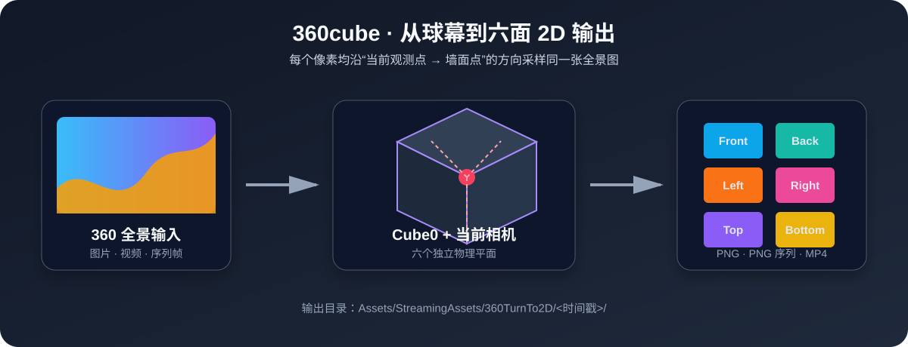

# 360cube

> 将等距柱状（Equirectangular）360° 全景内容，实时映射到自定义物理尺寸的六面 Cube，并导出为六路 2D 图片、图片序列或 MP4 视频。  
> Real-time mapping of equirectangular 360° panoramas onto a six-sided physical cube, with six independent 2D image, image-sequence, or MP4 outputs.



## 功能 / Features

- 创建可配置宽度、深度、高度的 `Cube0` 六面屏幕。  
  Create a six-sided `Cube0` with configurable width, depth, and height.
- 支持 360 全景图片、视频与图片序列帧输入。  
  Supports 360 panorama images, videos, and image sequences.
- 使用当前相机作为最佳观测点；移动观测点后，六面画面实时同步更新。  
  Uses the current camera as the viewing point; all six faces update live when it moves.
- 六面预览与球幕使用同一套世界空间射线投影，接缝连续。  
  The six-face preview and dome use the same world-space ray projection for continuous seams.
- 导出独立的 `Front`、`Back`、`Left`、`Right`、`Top`、`Bottom` 输出。  
  Exports independent `Front`, `Back`, `Left`, `Right`, `Top`, and `Bottom` outputs.
- 图片导出为 PNG，序列帧导出为六路 PNG 序列，视频使用 Unity Recorder 录制六路 MP4。  
  Images export as PNG, sequences export as six PNG sequences, and videos record as six MP4 files through Unity Recorder.
- 视频尺寸自动补齐到偶数像素，兼容 H.264 / MP4 编码要求。  
  Video dimensions are automatically rounded to even pixels for H.264 / MP4 compatibility.

## 环境要求 / Requirements

- Unity `2022.3 LTS`
- Universal Render Pipeline `14.x`
- 视频 MP4 导出另需安装 [Unity Recorder](https://docs.unity3d.com/Packages/com.unity.recorder@4.0/manual/index.html) `4.0.3` 或兼容版本。  
  MP4 output also requires Unity Recorder `4.0.3` or a compatible version.

## 快速开始 / Quick Start

1. 将本项目中的 `Assets/ScreenProjection` 导入 Unity 项目。  
   Import `Assets/ScreenProjection` into your Unity project.
2. 若需要导出 MP4，在 `Window → Package Manager` 安装 **Recorder**。  
   To export MP4, install **Recorder** from `Window → Package Manager`.
3. 从 Unity 顶部菜单打开 `GM → 360cube`。  
   Open `GM → 360cube` from Unity's top menu.
4. 选择输入类型：`360 Image`、`360 Video` 或 `Image Sequence`。  
   Choose `360 Image`, `360 Video`, or `Image Sequence`.
5. 输入 Cube0 的物理尺寸：宽度 `X`、深度 `Z`、高度 `Y`，然后点击 **Create Cube0 (Six Faces)**。  
   Enter Cube0 physical dimensions—width `X`, depth `Z`, height `Y`—then click **Create Cube0 (Six Faces)**.
6. 把主相机移动到最佳观测点。预览与最终生成都使用此刻相机位置，不会自动重置。  
   Move the main camera to the best viewing point. Preview and export use this exact position and never reset it automatically.
7. 选择生成方式：  
   Choose an output mode:
   - 图片：**Generate Six PNG Images** / Images: **Generate Six PNG Images**
   - 序列帧：**Generate Six PNG Sequences** / Sequences: **Generate Six PNG Sequences**
   - 视频：进入 Play 模式，点击 **Start Six MP4 Recordings**；达到所需时长后点击停止。  
     Video: enter Play mode, click **Start Six MP4 Recordings**, then stop after the required duration.

## 投影原理 / Projection Principle

对每一个六面墙像素，插件都计算从当前相机位置指向该墙面世界坐标点的方向，并以这个方向采样 360 全景图。  
For every pixel on every wall, the plugin calculates the direction from the current camera position to that wall's world-space point, then samples the 360 panorama along that direction.

```text
当前相机（观测点） → 墙面像素的世界坐标 → 360 全景图采样
Current camera (viewing point) → world-space wall pixel → 360 panorama sample
```

因此，六块墙面并不是由六张独立的静态贴图拼接而成；相机移动后，它们会重新按同一个观测点取样。只要在该观测点观察，六面屏幕呈现的结果就与置身同一张 360 球幕中一致。  
The six walls are not stitched from six static textures. When the camera moves, all walls are resampled from the same viewing point. From that point, the result matches viewing the same 360 dome.

## 输出文件 / Output Files

输出目录自动创建在：  
Outputs are automatically created in:

```text
Assets/StreamingAssets/360TurnTo2D/<timestamp>/
```

示例 / Example:

```text
20260817_153000_Front.png
20260817_153000_Back.png
20260817_153000_Left.png
20260817_153000_Right.png
20260817_153000_Top.png
20260817_153000_Bottom.png
```

图片序列会在各方向目录中按帧号保存。视频录制为手动停止模式：点击停止后 Recorder 才会写入并封装最终 MP4 文件。  
Image sequences are saved by frame number inside each direction folder. Video recording stops manually; Recorder writes and finalizes the MP4 files only after stopping.

## 仓库结构 / Repository Layout

```text
Assets/ScreenProjection/
├── Editor/       # GM → 360cube editor window and export tools
├── Materials/    # Preview materials
├── Scripts/      # Six-face layout, live projection, and camera control
└── Shaders/      # Equirectangular projection shaders
Docs/images/      # README images
```

## 发布为 `.unitypackage` / Release as a `.unitypackage`

在 Unity 的 Project 面板中选中 `Assets/ScreenProjection`，选择：  
In Unity's Project panel, select `Assets/ScreenProjection`, then choose:

```text
Assets → Export Package… → Include dependencies → Export
```

建议将导出的 `360cube.unitypackage` 附加到 GitHub Release，方便不使用 Git 的用户下载导入。请在 Release 说明中注明：视频 MP4 导出需要用户自行安装 Unity Recorder。  
Attach the exported `360cube.unitypackage` to a GitHub Release so users without Git can import it easily. Note that MP4 output requires users to install Unity Recorder themselves.

## 上传到 GitHub / Upload to GitHub

### 1. 在 GitHub 创建空仓库 / Create an empty repository

在 GitHub 点击 **New repository**。创建时不要勾选 README、`.gitignore` 或 License，因为本地已经准备好前两项。  
Click **New repository** on GitHub. Do not initialize it with a README, `.gitignore`, or License because the local project already includes the first two.

### 2. 在项目根目录执行 / Run from the project root

```powershell
git init
git add .
git commit -m "Initial release of 360cube"
git branch -M main
git remote add origin https://github.com/<your-account>/<repository>.git
git push -u origin main
```

如果 GitHub 使用 SSH，将远程地址替换为：  
For SSH, replace the remote address with:

```powershell
git remote add origin git@github.com:<your-account>/<repository>.git
```

### 3. 创建可下载版本 / Create a downloadable release

1. 在 Unity 导出 `360cube.unitypackage`。 / Export `360cube.unitypackage` from Unity.
2. 在 GitHub 仓库右侧点击 **Releases → Draft a new release**。 / Click **Releases → Draft a new release** in the repository.
3. 输入标签，例如 `v0.1.0`，并填写版本说明。 / Add a tag such as `v0.1.0` and release notes.
4. 将 `.unitypackage` 拖入附件区域，最后点击 **Publish release**。 / Attach the `.unitypackage`, then click **Publish release**.

## 注意事项 / Notes

- 360 输入必须是标准等距柱状全景：横向 360°，纵向 180°。  
  The 360 source must use standard equirectangular mapping: 360° horizontally and 180° vertically.
- 观测点是画面连续性的基准；从其他位置观看平面会产生正常的透视差。  
  The viewing point is the seam-continuity reference; viewing from elsewhere produces normal perspective differences.
- 视频录制需要在 Play 模式运行，并由用户手动停止。  
  Video recording runs in Play mode and must be stopped manually.
- 生成目录已在 `.gitignore` 中忽略，避免将大体积结果文件提交到 Git。  
  Generated output folders are ignored by `.gitignore` to avoid committing large files.
- 本仓库尚未声明许可证；公开发布前请根据你的发布意图添加 `LICENSE` 文件。  
  This repository has no declared license yet; add a `LICENSE` file before public distribution according to your intended terms.
